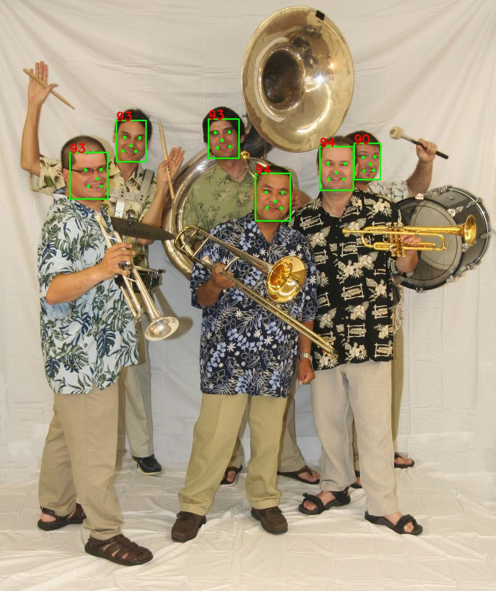

# Yuface
[](https://pypi.python.org/pypi/yuface)
[](LICENSE)
## Introduction 
A super fast face detector packaged by the [libfacedetection](https://github.com/ShiqiYu/libfacedetection) repository using pybind11.
## Change Log
[2023-5-8] Project init.

## Quick start
```shell
pip install yuface
```

### Usage
1. Load image
```python
# opencv
import cv2
img = cv2.imread('xxx.jpg')

# PIL
import PIL
import numpy as np
img = PIL.Image.open('xxx.jpg').convert('RGB')
img = np.array(img)                             # convert to numpy array
img = img[:, :, ::-1]                           # convert to BGR

# imageio
import imageio as io
img = io.imread('xxx.jpg')
img = img[:, :, ::-1]                           # convert to BGR
```
2. Detect
```python
# img: numpy.ndarray, shape=(H, W, 3), dtype=uint8, BGR
# conf_thresh: float, confidence threshold, default=0.5, range=[0.0, 0.1]
from yuface import detect
confs, bboxes, landmarks = detect(img, conf_thresh=0.5)
```
3. Deal result
```python
# confs: numpy.ndarray, shape=(N,), dtype=uint16, confidence 
# bboxes: numpy.ndarray, shape=(N, 4), dtype=uint16, bounding box (XYWH)
# landmarks: numpy.ndarray, shape=(N, 10), dtype=uint16, landmarks (XYXYXYXYXY)
import cv2
for conf, bbox, landmark in zip(confs, bboxes, landmarks):
    cv2.rectangle(img, (bbox[0], bbox[1]), (bbox[0] + bbox[2], bbox[1] + bbox[3]), (0, 255, 0), 1)
    cv2.putText(img, str(conf), (bbox[0], bbox[1]), cv2.FONT_HERSHEY_SIMPLEX, 0.5, (0, 0, 255), 1)
    for i in range(5):
        cv2.circle(img, (landmark[2*i], landmark[2*i+1]), 2, (0, 255, 0), 1)
cv2.imwrite('result.jpg', img)
```

